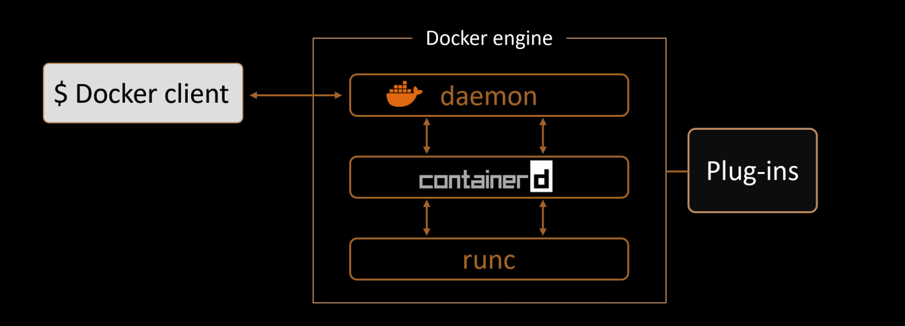
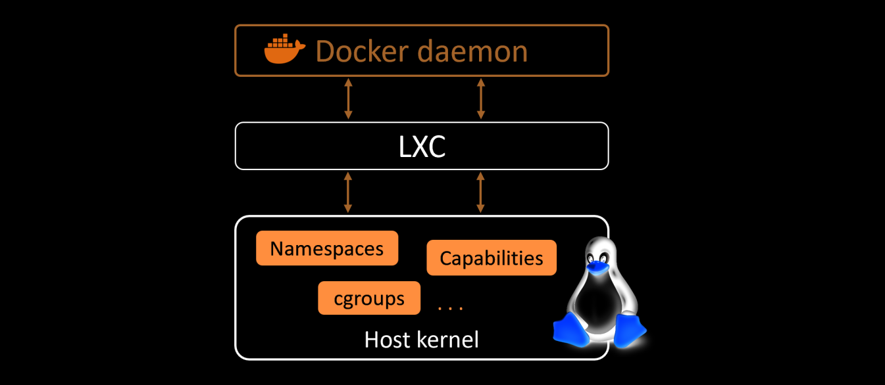
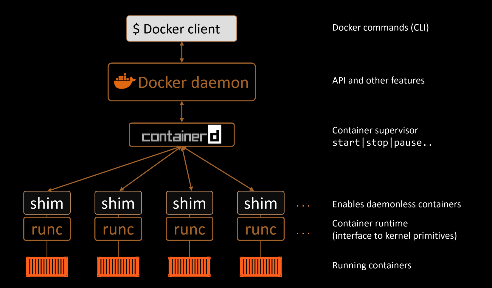
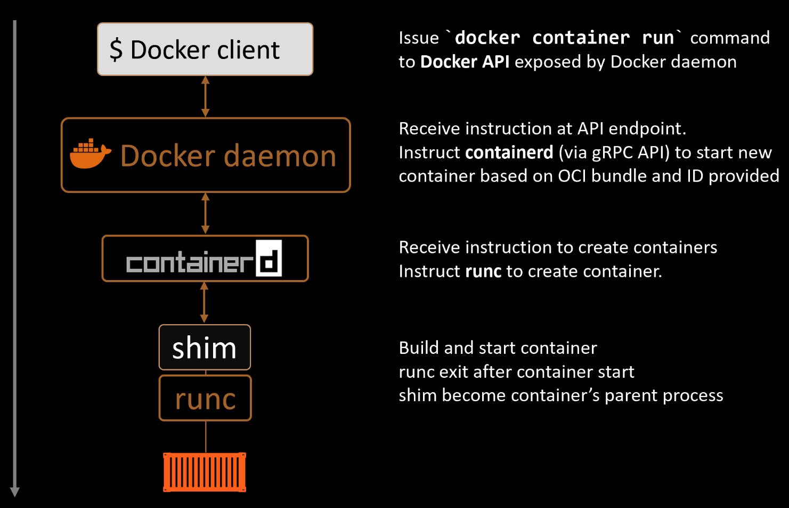
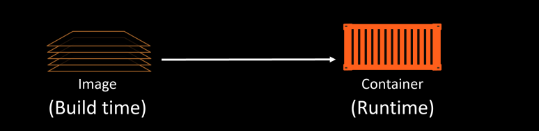
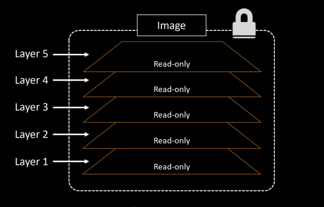

# Docker

---

## Overview
`Docker` is a software that runs on linux and windows. It creates, manages, and can even orchestrate containers.

The name "Docker" is referring to either of the following:
- Docker, Inc The company.
- Docker The technology.

## The Docker Technology
There are three most important things must be aware when we talking about `Docker` as a technology:
- **The runtime**
- **The daemon**
- **The orchestrator**

<br>

</br>

The `runtime` operates at the lowest level and is responsible for starting and stopping containers (this includes building all of the OS constructs such as namespaces and cgroups). Docker implements a tiered runtime
architecture with high-level and low-level runtimes that work together.

The low-level runtime is called `runc`. It's job is to interface with the underlying OS and start and stop containers. Every running container on a Docker node has a runc instance managing it.

The high-level runtime is called `containerd`. It's job is to manage the lifecycle of a container, including pulling images, creating network interfaces, and managing lower-level `runc` instances. A typical Docker instalation has a single containerd process (docker-containerd) controlling the runc (docker-runc) instances associated with each running container.

The Docker `daemon` (dockerd) sits above containerd and performs higher-level task such exposing the docker remote API, managing images, managing volumes, managing networks and more...


The Docker `swarms` is a native technology that is used to manage clusters or nodes running docker, it's like Kubernetes. just kubernetes it's common used.

## The Docker Engine
In this part we'll take a quick look under the hood of the Docker Engine. and we'll split it into three main sections:
- The TLDR
- The deep dive
- The commands

### The Docker Engine - The TLDR

The `Docker Engine` is the core software that runs and manages containers. and is build from many small specialised tools.

In short, Docker engine is like a car engine, both are modular and created by connecting many small specialized parts:

- A car engine is made from many specialized parts that work together to make a car drive, intake, manifolds etc.
- The `Docker Engine` is made from many specialized tools that work together to create and run containers, APIs, execution driver etc.

The major components that make up the Docker engine are `the Docker daemon`, `containerd`, `runc`, and various plugins such as networking and storage.

<br>

</br>

These components together are create and run containers.

### The Docker Engine - The Deep Dive

When Docker was first released, the Docker engine had two major components:
- The Docker daemon
- LXC

The **Docker daemon** is a binary that contains all of the code for the Docker client, the Docker API, the container runtime, image builds and much more.

**LXC** provided the daemon with access to the fundamentals building-blocks of containers that existed in the linux kernel. Things like *namespaces* and *control groups (cgroups)*.

<br>

</br>

The figure shows the old Docker Engine architecture.

Next, Docker Inc, updated it and developped `libcontainer` tool that replaced `LXC`, also it refactored the `docker daemon` into small and specialized tools.

<br>

</br>

This picture shows a high-level view of the current Docker engine architecture.
let's explain some of these refactored things:
- **`runc:`** is the reference implementation of the OCI (Open Container Initiative) container-runtime-spec. it's a small, lightweight CLI wrapper for `libcontainer`. It's job is to create containers.

- **`containerd:`** is a tool that manages the container lifecycle operations (start | stop | pause | rm...). It has also some other functionalities like image pulls, volumes and networks.


So, Now that we have a view of the big picture, let's walk through the process of creating a new container:
1. launching the container using the command `docker container run --name ctr1 -it alpine:latest sh`
2. The Docker client converts the command into the appropriate API payload and POSTs it to the API endpoint exposed by the Docker daemon.
3. Once the daemon receives the command to create a new container, it makes a call to containerd.
4. containerd converts the required Docker image into an OCI bundle and tells runc to create a new container.
5. runc interfaces with the OS kernel to pull together al of the constructs necessary to create a container (namespaces, cgroups etc).
6. The container process is started as a child process of runc and as soon as it is started runc will exit.
7. The container is now started.

The process is summarized in picture bellow.

<br>

</br>

Some of the diagrams above have shown a shim component, so what is it?

**what is shim**
We mentioned earlier that containerd uses runc to create new containers. In fact, it forks a new instance of runc
for every container it creates. However, once each container is created, the parent runc process exits.

Once a container's parent runc exits, the associated `containerd-shim` process becomes the container's parent.

## Docker Images
In this part we're going to get a solid understanding of what Docker images are, how to perform basic operations, and how they work
under-the-hood.

As usual, we'll split this part into three main sections:
- The TLDR
- The deep dive
- The commands


### Docker Images - The TLDR
A Docker image is a unit of packaging that contains everything required for an application to run. This includes code, dependencies, and OS constructs.

You can think if Docker images as similar to VM templates. A VM template is like a stopped VM, A Docker image is like a stopped container.

You get Docker images by pulling them from an image registry (most common is Docker Hub). The pull operation downloads the image to your local Docker host where Docker can use it to start one or more containers.

### Docker Images - The deep dive
We've mentioned earlier that `images` are like stopped containers. In fact, you can stop a container and create a new image from it. With this in mind, `images` are considered build-time constructs, whereas `containers` are run-time constructs.

<br>

</br>

The picture shows a high-level view of the relationship between images and containers.
Once you've started a container from an image, the two constructs become dependant on each other and you cannot delete the image untill the last container using it stopped and destroyed. Attempting to delete an image without stopping and destroying all containers using it will result in an error.

The process of getting images onto a Docker host is called *pulling*. So to pull the latest image on a Docker host, we've to pull it using the command `docker image pull redis:latest`, Then enter `docker image ls` to check your pulled images.

The following examples shows how to pull various different images from *offcial repositories*:

```bash
$ docker image pull mongo:4.2.6
// This will pull the image tagged as `4.2.6` from the official `mongo` repository.

$ docker image pull busybox:latest
// This will pull the image tagged as `latest` from the official `busybox` repository.

$ docker image pull alpine
// This will pull the image tagged as `latest` from the official `alpine` repository.
```

A couple of points about those commands.

First, if you **do not** specify an image tag after the repository name, Docker will assume you're referring to the image tagged as latest. In case of the repository doesn't have an image tagged as latest the command will fail.

Second, the latest tag does not guarantee it is the most recent image in a repository. For example, the most recent image in the alpine repository is usually tagged as edge.


A Docker image is just a bunch of loosely-connected read-only layers, with each layer comprising one or more files. This is shown in picture bellow.

<br>

</br>

Docker takes care of stacking these layers and representing them as a single unified object.

There are a few ways to see and inspect the layers that make up an image, considering this example:
```bash
$ docker image pull ubuntu:latest
latest: Pulling from library/ubuntu
952132ac251a: Pull complete
82659f8f1b76: Pull complete
c19118ca682d: Pull complete
8296858250fe: Pull complete
24e0251a0e2c: Pull complete
Digest: sha256:f4691c96e6bbaa99d...28ae95a60369c506dd6e6f6ab
Status: Downloaded newer image for ubuntu:latest
docker.io/ubuntu:latest
```
Each line in the example above that ends with "Pull complete" represents a layer in the image that was pulled. So in that example the image has 5 layers.

Another way to see the layers of an image is to inspect the image with the command `docker image inspect`.

Earlier, we've shown how to pull images using their name(tag). This is by far the most common method, but it has a problem, tags are mutable! this means it’s possible to accidentally tag an image with the wrong tag(name). Sometimes, it’s even possible to tag an image with the same tag as an existing, but different, image. this
can cause problems!

This where **image digests** method come to the rescue.

This method makes all images get a *cryptographic content hash*.

```bash
$ docker image pull alpine
Using default tag: latest
latest: Pulling from library/alpine
cbdbe7a5bc2a: Pull complete
Digest: sha256:9a839e63da...9ea4fb9a54
Status: Downloaded newer image for alpine:latest
docker.io/library/alpine:latest

$ docker image ls --digests alpine
REPOSITORY 	TAG			DIGEST							IMAGE ID		CREATED		SIZE
alpine     	latest 		sha256:9a839e63da...9ea4fb9a54 	f70734b6a266	2 days ago	5.61MB
```
The example output above shows the digest for the alpine image as `sha256:9a839e63da...9ea4fb9a54`.


When no longer need an image on our Docker host, we can delete it with the `docker image rm` command.

Deleting an image will remove the image and all its layers from your Docker host. However, if an image layer is shared by more than one image, that layer will not be deleted until all images that reference it have been deleted.

The following example deletes an image by its ID.
```bash
$ docker image rm 02674b9cb179
Untagged: alpine@sha256:c0537ff6a5218...c0a7726c88e2bb7584dc96
Deleted: sha256:02674b9cb179d57...31ba0abff0c2bf5ceca5bad72cd9
Deleted: sha256:e154057080f4063...2a0d13823bab1be5b86926c6f860
```

### Docker images - The commands
Let's remind ourselves of the major commands we use to work with Docker images.

- **`docker image pull`**: is the command to download images. We pull images from repositories inside of
remote registries. By default, images will be pulled from repositories on Docker Hub. This command
will pull the image tagged as latest from the alpine repository on Docker Hub: docker image pull
alpine:latest.

- **`docker image ls`**: lists all of the images stored in your Docker host’s local image cache. To see the SHA256 digests of images add the **--digests** flag.

- **`docker image inspect`**: is a thing of beauty! It gives you all of the glorious details of an image — layer data and metadata.

- **`docker image rm`**: is the command to delete images. You cannot delete an image that is associated with a container in the running (Up) or stopped (Exited) states.

## Docker containers
