# Docker

---

## Overview
`Docker` is a software that runs on linux and windows. It creates, manages, and can even orchestrate containers.

The name "Docker" is referring to either of the following:
- Docker, Inc The company.
- Docker The technology.

## The Docker Technology
There are three most important things must be aware when we talking about `Docker` as a technology:
- **The runtime**
- **The daemon**
- **The orchestrator**

<br>

</br>

The `runtime` operates at the lowest level and is responsible for starting and stopping containers (this includes building all of the OS constructs such as namespaces and cgroups). Docker implements a tiered runtime
architecture with high-level and low-level runtimes that work together.

The low-level runtime is called `runc`. It's job is to interface with the underlying OS and start and stop containers. Every running container on a Docker node has a runc instance managing it.

The high-level runtime is called `containerd`. It's job is to manage the lifecycle of a container, including pulling images, creating network interfaces, and managing lower-level `runc` instances. A typical Docker instalation has a single containerd process (docker-containerd) controlling the runc (docker-runc) instances associated with each running container.

The Docker `daemon` (dockerd) sits above containerd and performs higher-level task such exposing the docker remote API, managing images, managing volumes, managing networks and more...


The Docker `swarms` is a native technology that is used to manage clusters or nodes running docker, it's like Kubernetes. just kubernetes it's common used.

## The Docker Engine
In this part we'll take a quick look under the hood of the Docker Engine. and we'll split it into three main sections:
- The TLDR
- The deep dive
- The commands

### The Docker Engine - The TLDR

The `Docker Engine` is the core software that runs and manages containers. and is build from many small specialised tools.

In short, Docker engine is like a car engine, both are modular and created by connecting many small specialized parts:

- A car engine is made from many specialized parts that work together to make a car drive, intake, manifolds etc.
- The `Docker Engine` is made from many specialized tools that work together to create and run containers, APIs, execution driver etc.

The major components that make up the Docker engine are `the Docker daemon`, `containerd`, `runc`, and various plugins such as networking and storage.

<br>

</br>

These components together are create and run containers.

### The Docker Engine - The Deep Dive

When Docker was first released, the Docker engine had two major components:
- The Docker daemon
- LXC

The **Docker daemon** is a binary that contains all of the code for the Docker client, the Docker API, the container runtime, image builds and much more.

**LXC** provided the daemon with access to the fundamentals building-blocks of containers that existed in the linux kernel. Things like *namespaces* and *control groups (cgroups)*.

<br>

</br>

The figure shows the old Docker Engine architecture.

Next, Docker Inc, updated it and developped `libcontainer` tool that replaced `LXC`, also it refactored the `docker daemon` into small and specialized tools.

<br>

</br>

This picture shows a high-level view of the current Docker engine architecture.
let's explain some of these refactored things:
- **`runc:`** is the reference implementation of the OCI (Open Container Initiative) container-runtime-spec. it's a small, lightweight CLI wrapper for `libcontainer`. It's job is to create containers.

- **`containerd:`** is a tool that manages the container lifecycle operations (start | stop | pause | rm...). It has also some other functionalities like image pulls, volumes and networks.


So, Now that we have a view of the big picture, let's walk through the process of creating a new container:
1. launching the container using the command `docker container run --name ctr1 -it alpine:latest sh`
2. The Docker client converts the command into the appropriate API payload and POSTs it to the API endpoint exposed by the Docker daemon.
3. Once the daemon receives the command to create a new container, it makes a call to containerd.
4. containerd converts the required Docker image into an OCI bundle and tells runc to create a new container.
5. runc interfaces with the OS kernel to pull together al of the constructs necessary to create a container (namespaces, cgroups etc).
6. The container process is started as a child process of runc and as soon as it is started runc will exit.
7. The container is now started.

The process is summarized in picture bellow.

<br>

</br>

Some of the diagrams above have shown a shim component, so what is it?

**what is shim**
We mentioned earlier that containerd uses runc to create new containers. In fact, it forks a new instance of runc
for every container it creates. However, once each container is created, the parent runc process exits.

Once a container's parent runc exits, the associated `containerd-shim` process becomes the container's parent.

## Docker Images
In this part we're going to get a solid understanding of what Docker images are, how to perform basic operations, and how they work
under-the-hood.

As usual, we'll split this part into three main sections:
- The TLDR
- The deep dive
- The commands


### Docker Images - The TLDR
A Docker image is a unit of packaging that contains everything required for an application to run. This includes code, dependencies, and OS constructs.

You can think if Docker images as similar to VM templates. A VM template is like a stopped VM, A Docker image is like a stopped container.

You get Docker images by pulling them from an image registry (most common is Docker Hub). The pull operation downloads the image to your local Docker host where Docker can use it to start one or more containers.

### Docker Images - The deep dive
We've mentioned earlier that `images` are like stopped containers. In fact, you can stop a container and create a new image from it. With this in mind, `images` are considered build-time constructs, whereas `containers` are run-time constructs.

<br>

</br>

The picture shows a high-level view of the relationship between images and containers.
Once you've started a container from an image, the two constructs become dependant on each other and you cannot delete the image untill the last container using it stopped and destroyed. Attempting to delete an image without stopping and destroying all containers using it will result in an error.

The process of getting images onto a Docker host is called *pulling*. So to pull the latest image on a Docker host, we've to pull it using the command `docker image pull redis:latest`, Then enter `docker image ls` to check your pulled images.

The following examples shows how to pull various different images from *offcial repositories*:

```bash
$ docker image pull mongo:4.2.6
// This will pull the image tagged as `4.2.6` from the official `mongo` repository.

$ docker image pull busybox:latest
// This will pull the image tagged as `latest` from the official `busybox` repository.

$ docker image pull alpine
// This will pull the image tagged as `latest` from the official `alpine` repository.
```

A couple of points about those commands.

First, if you **do not** specify an image tag after the repository name, Docker will assume you're referring to the image tagged as latest. In case of the repository doesn't have an image tagged as latest the command will fail.

Second, the latest tag does not guarantee it is the most recent image in a repository. For example, the most recent image in the alpine repository is usually tagged as edge.


A Docker image is just a bunch of loosely-connected read-only layers, with each layer comprising one or more files. This is shown in picture bellow.

<br>

</br>

Docker takes care of stacking these layers and representing them as a single unified object.

There are a few ways to see and inspect the layers that make up an image, considering this example:
```bash
$ docker image pull ubuntu:latest
latest: Pulling from library/ubuntu
952132ac251a: Pull complete
82659f8f1b76: Pull complete
c19118ca682d: Pull complete
8296858250fe: Pull complete
24e0251a0e2c: Pull complete
Digest: sha256:f4691c96e6bbaa99d...28ae95a60369c506dd6e6f6ab
Status: Downloaded newer image for ubuntu:latest
docker.io/ubuntu:latest
```
Each line in the example above that ends with "Pull complete" represents a layer in the image that was pulled. So in that example the image has 5 layers.

Another way to see the layers of an image is to inspect the image with the command `docker image inspect`.

Earlier, we've shown how to pull images using their name(tag). This is by far the most common method, but it has a problem, tags are mutable! this means it’s possible to accidentally tag an image with the wrong tag(name). Sometimes, it’s even possible to tag an image with the same tag as an existing, but different, image. this
can cause problems!

This where **image digests** method come to the rescue.

This method makes all images get a *cryptographic content hash*.

```bash
$ docker image pull alpine
Using default tag: latest
latest: Pulling from library/alpine
cbdbe7a5bc2a: Pull complete
Digest: sha256:9a839e63da...9ea4fb9a54
Status: Downloaded newer image for alpine:latest
docker.io/library/alpine:latest

$ docker image ls --digests alpine
REPOSITORY 	TAG			DIGEST							IMAGE ID		CREATED		SIZE
alpine     	latest 		sha256:9a839e63da...9ea4fb9a54 	f70734b6a266	2 days ago	5.61MB
```
The example output above shows the digest for the alpine image as `sha256:9a839e63da...9ea4fb9a54`.


When no longer need an image on our Docker host, we can delete it with the `docker image rm` command.

Deleting an image will remove the image and all its layers from your Docker host. However, if an image layer is shared by more than one image, that layer will not be deleted until all images that reference it have been deleted.

The following example deletes an image by its ID.
```bash
$ docker image rm 02674b9cb179
Untagged: alpine@sha256:c0537ff6a5218...c0a7726c88e2bb7584dc96
Deleted: sha256:02674b9cb179d57...31ba0abff0c2bf5ceca5bad72cd9
Deleted: sha256:e154057080f4063...2a0d13823bab1be5b86926c6f860
```

### Docker images - The commands
Let's remind ourselves of the major commands we use to work with Docker images.

- **`docker image pull`**: is the command to download images. We pull images from repositories inside of
remote registries. By default, images will be pulled from repositories on Docker Hub. This command
will pull the image tagged as latest from the alpine repository on Docker Hub: docker image pull
alpine:latest.

- **`docker image ls`**: lists all of the images stored in your Docker host’s local image cache. To see the SHA256 digests of images add the **--digests** flag.

- **`docker image inspect`**: is a thing of beauty! It gives you all of the glorious details of an image — layer data and metadata.

- **`docker image rm`**: is the command to delete images. You cannot delete an image that is associated with a container in the running (Up) or stopped (Exited) states.

## Docker containers
In this part we're going to get into containers.
And as usual we'll split this chapter into three sections:
- The TLDR
- The deep dive
- The commands

### Docker containers - The TLDR
A container is the runtime instance of an image. they're so faster and lightweight because they share the OS/kernel with the host they're running on. We can start one or more containers from a single image

<br>
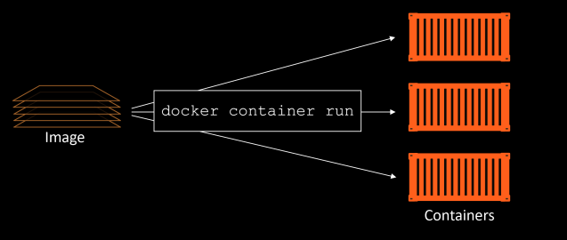
</br>

The simplest way to start a container is with the `docker container run` command, but its most basic form you tell it an image to use and a app to run: `docker container run <image> <app>`. The following command will start an *Ubuntu Linux* container running the *Bash shell* as its app.
```bash
$ docker container run -it ubuntu /bin/bash
```

The `-it` flag will connect your current terminal window to the container's shell.
Containers run until the app they are executing exits. In the previous examples, the Linux container will exit when the Bash shell exits.

You can manually stop a running container with the `docker container stop` command.

### Docker containers - The deep dive
The first things we'll cover here are the fundamental differences between a container and a VM.
Anyway, Let's start with a scenario, let's assume a requirement where your business has a single physical server that needs to run 4 business applications.
In the VM model, The physical server is powered on and the hypervisor boots. Once booted, the hypervisor lays claim to all physical resources on the system such as CPU, RAM, ROM, and NICs. It then carves these hardware resources into virtual versions that look smell and feel exactly like the real thing. It then packages them into a software construct called a virtual machine (VM). We take those VMs and install an operating system and application on each one. So the scenario in that model will look like

<br>
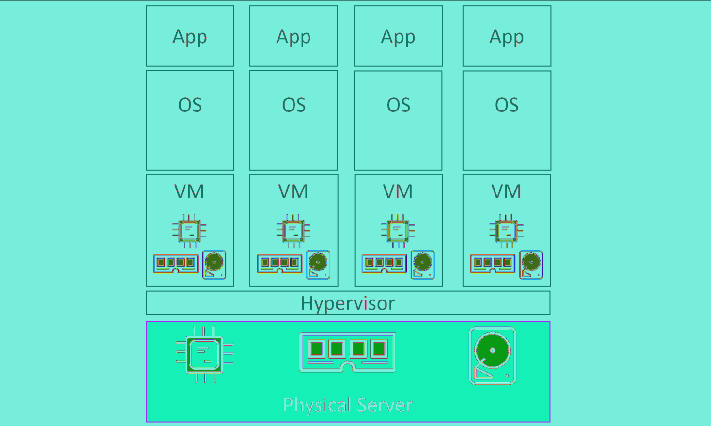
</br>

Things are a bit different in the container model.
The server is powered on and the OS boots. the OS claims all hardware resources. On top of the OS, we install a container engine such as Docker. The container engine then takes OS resources such as the *process tree*, the *filesystem*, and the *network stack*, anc carves them into isolated constructs called containers. Each container looks smells and feels just like a real OS. Inside of each container we run an application. So the scenario will look like

<br>
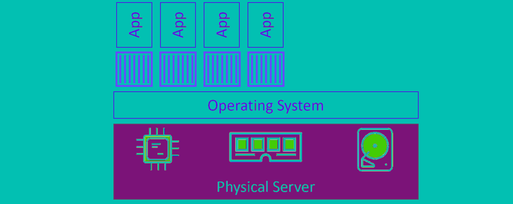
</br>

At a high level, hypervisors perform **hardware virtualization** — they carve up physical hardware resources into virtual versions called VMs. On the other hand, containers perform **OS virtualization** — they carve OS resources into virtual versions called containers.

As a result, The VM model carves **low-level hardware resources** into VMs. Each VM is a software construct containing virtual CPUs, virtual RAm, virtual disks etc.As such every VM needs its own OS to manage those virtual resources.
The container model has a single OS/kernel running on the host. It's possible to run tens or hunderds of containers on a single host with every container sharing that single OS/kernel.
Another thing to consider is application start times. As a container isn't a full-blown OS, it starts **much faster** than a VM.

Well, one thing that's not so great about the container model is **security**. Out of the box, containers are less secure and provide less workload isolation than VMs.

Now, let's play around with some containers.
The simplest way to start a container is with the `docker container run` command.
The following command starts a simple container that will run a containerized version of Ubuntu Linux.
```bash
$ docker container run -it ubuntu:latest /bin/bash
Unable to find image 'ubuntu:latest' locally
latest: Pulling from library/ubuntu
d51af753c3d3: Pull complete
fc878cd0a91c: Pull complete
6154df8ff988: Pull complete
fee5db0ff82f: Pull complete
Digest: sha256:747d2dbbaaee995098c9792d99bd333c6783ce56150d1b11e333bbceed5c54d7
Status: Downloaded newer image for ubuntu:latest
root@50949b614477:/#
```

When we started the Ubuntu container in the above example, we told it to run *Bash shell*. This makes the Bash shell the **one and only process running inside of the container**.
If you're logged on to the container and type exit, you'll terminate the Bash process and the container will exit (terminate). This is because a container cannot exist without its designated main process. So **killing the main process in the container will kill the container**.

Press *Ctrl-PQ* to exit the container without terminating its main process.

You can use the `docker container ls` command to list all the running containers in you system.

```bash
$ docker container ls
CNTNR ID IMAGE               COMMAND        CREATED         STATUS          NAMES
509...74 ubuntu:latest       /bin/bash      6 mins          Up 6mins        sick_montalcini
```

This container is still running and you can re-attach your terminal to it with the `docker container exec` command.
```bash
$ docker container exec -it 50949b614474 bash
root@50949b614477:/#
```

You can stop and delete a container using the following two commands.
```bash
$ docker container stop 50949b614474
50949b614474

$ docker container rm 50949b614474
50949b614474
```

Containers can save data, If you write some data in a running container and then you stopped it, then you restart it again, the data will still there, but even if that illustrates the persistent nature of containers, it's important to understand two things:
1. The data created is stored on the Docker hosts local filesystem. If the docker host fails, the data will be lost.
2. Containers are designed to be immutable objects and it's not a good practice to write data to them.

For these reasons, Docker provides *volumes* that exist separately from the container, but can be mounted into the container at runtime.

### Docker containers - The commands
- **`docker container run`**: is the command used to start new containers.

- **`Ctrl-PQ`**: will detach your shell from the terminal of a container and leave the container running (UP) in the background.

- **`docker container ls`**: lists all containers in the running (UP) state. If you add the *-a* flag you will also see containers in the stopped (Exited) state.

- **`docker container exec`**: runs a new process inside of a running container. It’s useful for attaching the shell of your Docker host to a terminal inside of a running container.

- **`docker container stop`**: will stop a running container and put it in the Exited (0) state.

- **`docker container start`**: will restart a stopped (Exited) container.

- **`docker container rm`**: will delete a stopped container.
- **`docker container inspect`**: will show you detailed configuration and runtime information about a
container. It accepts container names and container IDs as its main argument.

## Containerizing an app
Docker is all about taking applications and running them in containers.

The process of taking an application and configuring it to run as a container is called "**containerizing**".

In this chapter, we'll walk through the process of containerizing a simple linux-based web application.
We'll split this chapter into the usual three parts:
- The TLDR
- The deep dive
- The commands

Let's containerize an app!

### Containerizing an app - The TLDR
The process of containerizing an app looks like this:
1. Start with your application code and dependencies
2. Create a Dockerfile that describes your app, its dependencies, and how to run it
3. Feed the Dockerfile into the docker image build command
4. Push the new image to a registry (optional)
5. Run container from the image

### Containerizing an app - The deep dive
This chapter walks through the process of containerizing a simple Node.js web app.

We'll complete the following high-level steps:
- Clone the repo to get the app code
- Inspect the Dockerfile
- Containerize the app
- Run the app

So, let's get in!
#### Getting the application code
The application used in this example is available on Github at `https://github.com/nigelpoulton/psweb.git`
Clone the app from github.
```bash
$ git clone https://github.com/nigelpoulton/psweb.git
```

move to the app directory

```bash
$ cd psweb
$ ls -l
total 28
-rw-r--r-- 1 root root 341 Sep 29 16:26 app.js
-rw-r--r-- 1 root root 216 Sep 29 16:26 circle.yml
-rw-r--r-- 1 root root 338 Sep 29 16:26 Dockerfile
-rw-r--r-- 1 root root 421 Sep 29 16:26 package.json
-rw-r--r-- 1 root root 370 Sep 29 16:26 README.md
drwxr-xr-x 2 root root 4096 Sep 29 16:26 test
drwxr-xr-x 2 root root 4096 Sep 29 16:26 views
```

Now that we have the app code, let's look at its Dockerfile.

#### Inspecting the Dockerfile
A **Dockerfile** is the starting point for creating a container image, it describes an application and tells Docker how to build it into an image.

Let's look at the contents of the Dockerfile.
```bash
$ cat Dockerfile
FROM alpine
LABEL maintainer="nigelpoulton@hotmail.com"
RUN apk add --update nodejs nodejs-npm
COPY . /src
WORKDIR /src
RUN npm install
EXPOSE 8080
ENTRYPOINT ["node", "./app.js"]
```

At a high-level, the Dockerfile says: Start with alpine image, make a note that "nigelpoulton@hotmail.com" is the maintainer, install Node.js and NPM, copy everthing in the build context to the /src directory in the image, set the working directory as /src, install depedencies, document the app's network port, and set app.js as the default application to run.

#### Containerize the app/build the image
So, let's build the image!
The following command will build a new image called web:latestl. The period (.) at the end of the command tells docker to use shell's current working directory as the *build context*.
```bash
$ docker image build -t web:latest .
```

Check that the image exists in your Docker host's local repository.
```bash
$ docker image ls
REPO          TAG         IMAGE ID            CREATED            SIZE
web           latest      fc69fdc4c18e        10 seconds ago     81.5MB
```

Congratulations, the app is containerized!

#### Run the app
The containerized application is a web server that listens on TCP port 8080.
The following command will start a new container called c1 based on the web:latest image you just created. It maps port 80 on the docker host, to port 8080 inside the container.

```bash
$ docker container run -d --name c1 \
-p 80:8080 \
web:latest
```

Check that the container is running and verify the port mapping.
```bash
$ docker container ls
ID               IMAGE          COMMAND            STATUS          PORTS                   NAMES
49..             web:latest     "node ./app.js"    UP 6 secs       0.0.0.0:80->8080/tcp    c1
```

Congratualtions!, the app container is running. Note that port 80 is mapped, on all host interfaces (0.0.0.0:8080).

Open a web browser and point it to the DNS name or IP address of the host that the container is running on.
and you'll see the web page.


### Containerizing an app - The commands
- **`docker image build`**: is the command that reads a Dockerfile and containerizes an application.
- The **`FROM`**: instruction in a Dockerfile specifies the base image for the new image you will build.
- The **`RUN`**: instruction in a Dockerfile allows you to run commands inside the image. Each RUN instruction
creates a single new layer.
- The **`COPY`**: instruction in a Dockerfile adds files into the image as a new layer. It is common to use the COPY instruction to copy your application code into an image.
- The **`EXPOSE`**: instruction in a Dockerfile documents the network port that the application uses.
- The **`ENTRYPOINT`**: instruction in a Dockerfile sets the default application to run when the image is started as a container.

## Docker Compose
**Docker Compose** is a tool that deploys and manages multi-container applications on Docker nodes running in ***single-engine mode***.

In this chapter, we'll  look at how to deploy multi-container applications using Docker Compose.

We'll split this chapter into the usual three parts:
- The TLDR
- The deep dive
- The commands

### Docker Compose - The TLDR
Modern cloud-native apps are made of multiple smaller services that interact to form a useful app. We call this pattern "microservices". A simple example might be an app with following seven services:
- Web front-end
- Ordering
- Catalog
- Back-end
- logging
- Authentication
- Authorization

Deploying and managing lots of small microservices like these can be hard. This is where *Docker Compose* comes in to play.

So, Docker Compose lets you describe an entire app in a single declarative configuration file, and deploy it with a single command.

Once the app is *deployed*, you can manage its entire lifecycle with a simple set of commands.

### Docker Compose - The Deep Dive
#### Compose background
In the beginning was *Fig*. Fig was a powerfull tool, created by *Orchard* company, and it was the best way to manage multi-container Docker apps. It was a Python tool that sat on top of Docker, and let you define entire mutli-container apps in a single YAML file. You could then deploy and manage the lifecycle of the app with the `fig` command-line tool.

Behind the scenes, Fig would read the YAML file and use Docker to deploy and manage the app via the Docker API. It was a good thing.

In fact, it was so good, that Docker Inc. acquired *Orchard* and re-branded Fig as Docker Compose. The command-line tool was renamed from `fig` to `docker-compose`, and continues to be an external tool that gets bolted top of the Docker Engine.

As things stand today, Compose is still an external Python binary that you have to install on a Docker host. You define mutli-container (microservices) apps in a YAML file, pass the file to the `docker-compose` command line, and Compose deploys it via the Docker API.

#### Installing Compose
Now, we're going to install Docker Compose on a Linux-based OS, and it required two-steps.

**First**
Download the binary using the curl command
```bash
$ sudo curl -L \
"https://github.com/docker/compose/releases/download/1.25.5/docker-compose-$(uname -s)-$(uname -m)" \
-o /usr/local/bin/docker-compose
```

**Second**
Make the binary executable using chmod.
```bash
$ sudo chmod +x /usr/local/bin/docker-compose
```

Then you can verify the installation of Compose.
```bash
$ docker-compose --version
```

#### Compose files
Compose uses YAML files to define mutli-service applications. YAML is a subset of JSON, so you can also use JSON.

The default name for a Compose YAML file is `docker-compose.yml`.

The following example shows a very simple Compose file that defines a small Flask app with two microservices (web-fe and redis).
```yml
version: "3.8"
services:
	web-fe:
		build: .
		command: python app.py
		ports:
			- target: 5000
				published: 5000
		networks:
			- counter-net
		volumes:
			- type: volume
			source: counter-vol
			target: /code
	redis:
		image: "redis:alpine"
		networks:
			counter-net:
networks:
	counter-net:
volumes:
	counter-vol:
```

The first thing to note is that the file has 4 top-level keys:
- version
- services
- networks
- volumes

The `version` key is mandatory, and it's always the first line at the root of the file. and it defines the version of the Compose file format.

And it's important to note that the `version` key does not define the version of Docker Compose or the Docker Engine.

The top-level `services` key is where you define the different application microservices. This example defines two services; a web front-end called *web-fe*, and an in-memory database called *redis*. Compose will deploy each of these services as its own container.

The top-level `networks` key tells Docker to create new networks. By default, Compose will create bridge networks. These are single-host networks that can only connect containers on the same Docker host.

The top-level `volumes` key is where you tell Docker to create new volumes.

In summary, Compose will instruct Docker to deploy a single standalone container for the *web-fe* service. It
will be based on an image built from a Dockerfile in the same directory as the Compose file. This image will be
started as a container and run *app.py* as its main app. It will expose itself on port *5000* on the host, attach to the *counter-net* network, and mount a volume to */code*. Then it will start a single standalone container for the *redis* service. The *redis* container will be attached to the *counter-net* network.

Now that we understand how the Compose file  works, let's deploy it!

#### Deploying an app with compose
In this section, we’ll deploy the app defined in the Compose file from the previous section. To do this, you’ll need the following 4 files from `hps://github.com/nigelpoulton/counter-app`:
- Dockerfile
- app.py
- requirements.txt
- docker-compose.yml

So, Clone the repository to get the files. And let's deploy the  app using the `docker-compose up` command.
```bash
$ docker-compose up &
```

This command builds or pulls all required images, creates all required networks and volumes, and starts all required containers.

With the application successfully deployed, you can point a web browser at your docker host on port *5000*  and see the application in all its glory.

#### Managing an app with Compose
In this section, you'll see how to start, stop, delete, and get the status of applications being managed by Docker Compose.  You’ll also see how the volume we’re using can be used to directly inject updates to the app’s web front-end.

As the application is already up. let's see how to bring it down. To do this, replace the *up* sub-command with *down*.
```bash
$ docker-compose down
1. Stopping counter-app_redis_1 ...
2. Stopping counter-app_web-fe_1 ...
3. redis_1 | 1:signal-handler Received SIGTERM scheduling shutdown...
4. redis_1 | 1:M 09 Jan 11:16:00.456 # User requested shutdown...
5. redis_1 | 1:M 09 Jan 11:16:00.456 * Saving the final RDB snap...
6. redis_1 | 1:M 09 Jan 11:16:00.463 * DB saved on disk
7. Stopping counter-app_redis_1 ... done
8. counter-app_redis_1 exited with code 0
9. Stopping counter-app_web-fe_1 ... done
10. Removing counter-app_redis_1 ... done
11. Removing counter-app_web-fe_1 ... done
12. Removing network counter-app_counter-net
13. [1]+ Done
docker-compose up
```

It’s important to note that the *counter-vol* volume was not deleted. This is because volumes are intended to be
long-term persistent data stores. As such, their lifecycle is entirely decoupled from the applications they serve. Running a `docker volume ls` will show that the volume is still present on the system. If you’d written any data to the volume, that data would still exist.

Also, any images that were built or pulled as part of the `docker-compose up` operation will still be present on
the system. This means future deployments of the app will be faster.

Use the following command to bring the app up again, but this time in the background.
```bash
$ docker-compose up-d
Creating network "counter-app_counter-net" with the default driver
Creating counter-app_redis_1 ... done
Creating counter-app_web-fe_1 ... done
```

Show the current state of the app with the `docker-compose ps` command.
```bash
$ docker-compose ps
Name                   Command                        State            Ports
----------------------------------------------------------------------------------
counter-app_redis_1    docker-entrypoint.sh redis..   Up               6379/tcp
counter-app_web-fe_1   python app.py                  Up               0.0.0.0:5000->5000/tcp
```

Use `docker-compose top` to list the processes running inside of each service (container).
```bash
$ docker-compose top
counter-app_redis_1
PID     USER     TIME     COMMAND
--------------------------------------
19643   999      0:01     redis-server

counter-app_web-fe_1
PID     USER     TIME     COMMAND
-------------------------------------------------------
19679   root     0:00     python app.py
19788   root     0:01     /usr/local/bin/python /code/app.py
```

Use the `docker-compose stop` command to stop the app without deleting its resources. Then show the status of
the app with `docker-compose ps`.

```bash
$ docker-compose stop
Stopping counter-app_web-fe_1 ... done
Stopping counter-app_redis_1 ... done
```

```bash
$ docker-compose ps
Name                  Command                        State
-----------------------------------------------------------
counter-app_redis_1   docker-entrypoint.sh redis     Exit 0
counter-app_web-fe_1  python app.py                  Exit 0
```

You can delete a stopped Compose app with `docker-compose rm`. This will delete the containers and networks
the app is using, but it will not delete volumes or images. Nor will it delete the application source code in your project’s build context directory (app.py, Dockerfile, requirements.txt, and docker-compose.yml).

You can use the `docker-compose down` command to **stop** and **delete** the app with a single command.

It's also worth nothing to mention that any update to the contents of app.py in the project’s working directory on the Docker host will be affected in real time. Just we need to copy the updated app.py to the volume on the Docker host. Then refresh the app’s web page to see the updated data. This will work because whatever you write to the volume on the Docker host will immediately appear in the volume mounted in the container.

### Deploying apps with Compose - The commands

- **`docker-compose up`**: is the command to deploy a Compose app. It expects the Compose file to be called
*docker-compose.yml*, but you can specify a custom filename with the `-f` flag.

- **`docker-compose stop`**: will stop all of the containers in a Compose app without deleting them from the
system.

- **`docker-compose rm`**: will delete a stopped Compose app. It will delete containers and networks, but it will not delete volumes and images.

- **`docker-compose restart`**: will restart a Compose app that has been stopped with `docker-compose stop`.

- **`docker-compose ps`**:  will list each container in the Compose app. It shows current state, the command
each one is running, and network ports.

- **`docker-compose down`**:  will stop and delete a running Compose app. It deletes containers and networks,
but not volumes and images.


## Docker Networking
Any time there’s a an infrastructure problem, we always blame the network. Part of the reason is that networks 
are at the center of everything — **no network, no app!**

In this chapter, we’ll look at the fundamentals of Docker networking. Things like the Container Network Model 
(CNM) and libnetwork. We’ll also get our hands dirty building some networks.

As usual, we’ll split the chapter into three parts:
- The TLDR
- The deep dive
- The commands

### Docker Networking - The TLDR
Docker runs applications inside of containers. and applications need to communicate over lots of different networks.

Docker has solutions for container-to-container networks, as well as connecting to existing networks and VLANs.

Docker networking is based on an open-source  pluggable architecture called the Container Network Model (CNM). *libnetwork* is Docker's real-world implementation of the CNM, and it provides all of Docker's core networking capabilities. Drivers plug in to libnetwork to provide specific network topologies.

To create a smooth out-of-the-box experience, Docker ships with a set of native drivers that deal with the most
common networking requirements. These include single-host bridge networks, multi-host overlays, and options
for plugging into existing VLANs. Ecosystem partners can extend things further by providing their own drivers.

Last but not least, libnetwork provides a native service discovery and basic container load balancing solution.

### Docker Networking - The deep dive
We’ll organize this section of the chapter as follows:
- Overview
- Single-host bridge networks
- Multi-host overlay networks
- Connecting to existing networks
- Service Discovery

#### Overview
At the highest level, Docker networking comprises three major components:
- The container Network Model (CNM)
- libnetwork
- Drivers

The **CNM** is the design specification. It outlines the fundamental building blocks of a Docker network.

libnetwork is a real-world implementation of the CNM, and is used by Docker. It’s written in Go, and implements
the core components outlined in the *CNM*.

Drivers extend the model by implementing specific network topologies such as VXLAN overlay networks.

This picture shows how they fit together at a very high level.

<br>
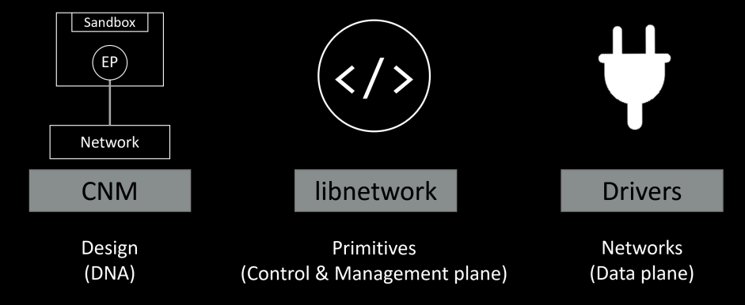
</br>

#### Single-host bridge networks
The simplest type of Docker network is the **single-host** bridge network.

We can extract two things from the name:
- **Single-host**: tell us it only exists on a single Docker host and can only connect containers that are on the same host. 
- **Bridge**: tell us that it's an implementation of an *802.1d* bridge (layer 2 switch).

This picture shows two Docker hosts with identical local bridge networks called “mynet”. Even though the
networks are identical, they are independent isolated networks. This means the containers in the picture cannot
communicate directly because they are on different networks.

<br>
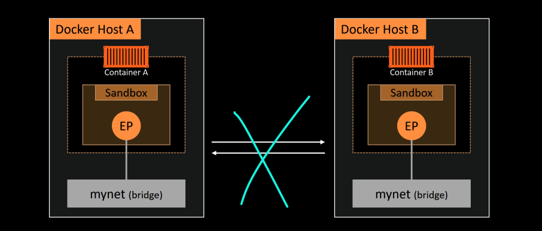
</br>

Every Docker host gets a default **single-host** bridge network. On Linux it’s called “bridge”. And by default it's the network that all new containers will be connected to unless you override it on the command line with the `--network` flag.

The following listing shows the output of a `docker network ls` command on newly installed linux host.The output is trimmed so that it only shows the default network on each host. Notice how the name
of the network is the same as the driver that was used to create it — this is a coincidence and not a requirement.
```bash
$ docker network ls

NETWORK ID              NAME       DRIVER           SCOPE
333e184cd343            bridge     bridge           local
```

Docker networks built with the bridge driver on Linux hosts are based on the battle-hardened linux bridge
technology that has existed in the Linux kernel.

The default “bridge” network, on all Linux-based Docker hosts, maps to an underlying Linux bridge in the kernel
called “docker0”. We can see this from the output of `docker network inspect`.
```bash
$ docker network inspect bridge | grep bridge.name
"com.docker.network.bridge.name": "docker0",
```

Let’s use the `docker network create` command to create a new single-host bridge network called “localnet”.

```bash
$ docker network create -d bridge localnet
```

The new network is created and will appear in the output of any future `docker network ls` commands. If you
are using Linux, you will also have a new Linux bridge created in the kernel.

Let's list the currently running bridges on the system using *brctl* tool.

```bash
$ brctl show

bridge name         bridge id              STP enabled              interfaces
docker0             8000.0242aff9eb4f      no
br-20c2e8ae4bbb     8000.02429636237c      no
```

The output shows two bridges. The first line is the “docker0” bridge that we already know about. This relates
to the default “bridge” network in Docker. The second bridge (br-20c2e8ae4bbb) relates to the new localnet
Docker bridge network. Neither of them have spanning tree enabled, and neither have any devices connected
(interfaces column).

At this point, the bridge configuration on the host looks like this figure.

<br>
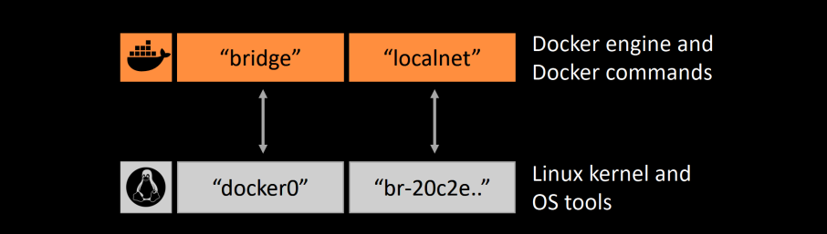
</br>

Let’s create a new container and attach it to the new localnet bridge network.

```bash
$ docker container run-d--name c1 \
  --network localnet \
  alpine sleep 1d
```

If you run the Linux *brctl* show command again, you’ll see c1’s interface attached to the br-20c2e8ae4bbb
bridge.

```bash
$ brctl show

bridge name         bridge id                STP enabled             interfaces
br-20c2e8ae4bbb     8000.02429636237c      no                        vethe792ac0
docker0             8000.0242aff9eb4f      no
```

And this is shown in this figure.

<br>

</br>


So far, we’ve said that containers on bridge networks can only communicate with other containers on the same
network. However, you can get around this using port mappings.

Port mappings let you map a container to a port on the Docker host. Any traffic hitting the Docker host on the
configured port will be directed to the container.

<br>
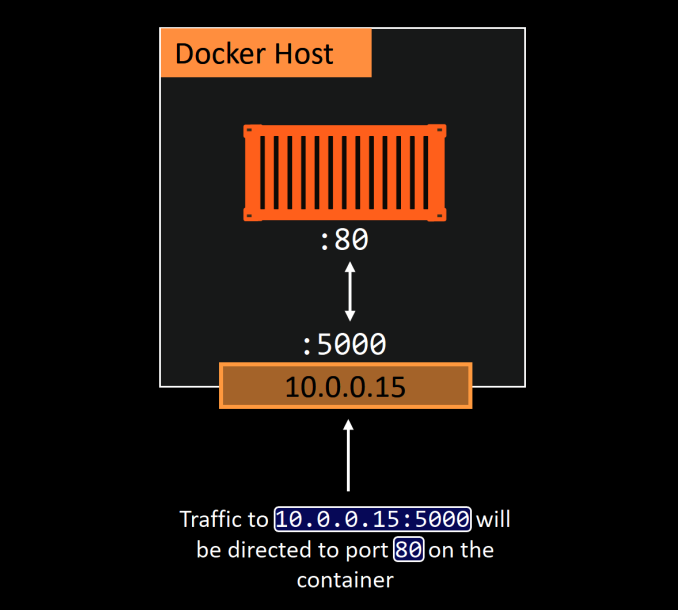
</br>


In the diagram, the application running in the container is operating on port `80`. This is mapped to port `5000` on the host’s `10.0.0.15` interface. The end result is all traffic hitting the host on `10.0.0.15:5000` being redirected to the container on port `80`.

Mapping ports like this works, but it’s clunky and doesn’t scale. For example, only a single container can bind to any port on the host. This means no other containers on that host will be able to bind to port 5000. This is one of the reason’s that **single-host** bridge networks are only useful for local development and very small applications.

#### Multi-host overlay networks
**Overlay networks** are multi-host. They allow a single network to span multiple hosts so that containers on
different hosts can communicate directly. They’re ideal for container-to-container communication, including
container-only applications, and they scale well.

Docker provides a native driver for **overlay** networks. This makes creating them as simple as adding the `--d overlay` flag to the `docker network create` command.


#### Connecting to existing networks
The ability to connect containerized apps to external systems and physical networks is vital. A common example
is a partially containerized app — the containerized parts need a way to communicate with the non-containerized
parts still running on existing physical networks and VLANs.

The built-in *MACVLAN* driver was created with this in mind. It makes containers first class citizens on the existing physical networks by giving each one its own MAC address and IP addresses, as shown in that figure.

<br>
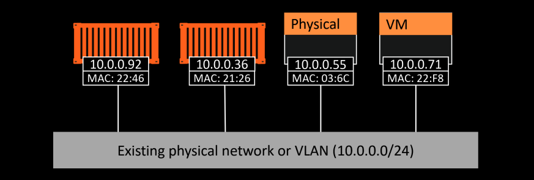
</br>

On the positive side, *MACVLAN* performance is good as it doesn’t require port mappings or additional bridges —
you connect the container interface through to the hosts interface (or a sub-interface). However, on the negative side, it requires the host NIC to be in **promiscuous mode**, which isn’t always allowed on corporate networks and public cloud platforms. So *MACVLAN* is great for your corporate data center networks (assuming your network team can accommodate promiscuous mode), but it might not work in the public cloud.

#### Service discovery
As well as core networking, libnetwork also provides some important network services.

**Service discovery** allows all containers and Swarm services to locate each other by name. The only requirement is that they be on the same network.

Under the hood, this leverages Docker’s embedded *DNS server* and the *DNS resolver* in each container. This Figure shows container “c1” pinging container “c2” by name. The same principle applies to Swarm Services.

<br>
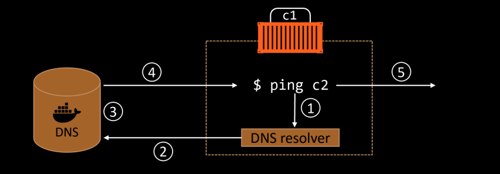
</br>

### Docker Networking- The Commands
Docker networking has its own docker network sub-command. e main commands include:
- **`docker network ls`**:  Lists all networks on the local Docker host.
- **`docker network create`**:  Creates new Docker networks. By default, it creates them with the "nat" driver on Windows and the "bridge" driver on Linux. You can specify the driver (type of network) with the `-d` flag.
`docker network create -d overlay overnet` will create a new overlay network called overnet with the
native Docker overlay driver.
- **`docker network inspect`**:  Provides detailed configuration information about a Docker network.
- **`docker network prune`**:  Deletes all unused networks on a Docker host.
- **`docker network rm`**: Deletes specific networks on a Docker host.

## Volumes and persistent data
We’ll turn our attention in this chapter to investigating how Docker handles applications that write persistent data.

We’ll split the chapter into the usual three parts:
- The TLDR
- The deep dive
- The commands

### Volumes and persistent data - The TLDR

There are two main categories of data — **persistent** and **non-persistent**.

**Persistent** is the data you need to keep. things like; customer records, financial data, research results, etc... **Non-persistent** is the data you don’t need to keep.

Both are important, and Docker has solutions for both.

To deal with **non-persistent** data, every Docker container gets its own non-persistent storage. This is automatically created for every container and is tightly coupled to the lifecycle of the container. As a result, deleting the container will delete the storage and any data on it.

To deal with **persistent** data, a container needs to store it in a *volume*. ***Volumes*** are separate objects that have their lifecycles decoupled from containers. This means you can create and manage volumes independently, and they’re not tied to the lifecycle of any container. Net result, you can delete a container that’s using a volume, and the volume won’t be deleted.

### Volumes and persistent data - The Deep Dive
Let's cover some ways that containers deal with persistent and non-persistent data.
We’ll start out with non-persistent data.

#### Containers and non-persistent data
Many applications require a read-write filesystem in order to simply run – they won’t even run on
a read-only filesystem. This means it’s not as simple as making containers entirely read-only. Every Docker
container is created by adding a thin read-write layer on top of the read-only image it’s based on.

This figure shows two running containers sharing a single read-only image.
<br>
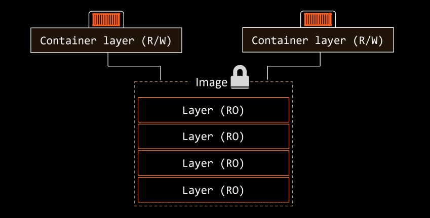
</br>

The writable container layer exists in the filesystem of the Docker host, and you’ll hear it called various names. These include **local storage**, **ephemeral storage**, and **graphdriver storage**. It’s typically located on the Docker host in these locations:

- Linux Docker hosts: `/var/lib/docker/<storage-driver>/...`
- Windows Docker hosts:` C:\ProgramData\Docker\windowsfilter\...`

This thin writable layer is an integral part of a container and enables all read/write operations. If you, or an
application, update files or add new files, they’ll be written to this layer. However, it’s tightly coupled to the container’s lifecycle — it gets created when the container is created and it gets deleted when the container is deleted. The fact that it’s deleted along with a container means that it’s not an option for important data that you need to keep (persist).

#### Containers and persistent data
***Volumes*** are the recommended way to persist data in containers. There are three major reasons for this:

- Volumes are independent objects that are not tied to the lifecycle of a container
- Volumes can be mapped to specialized external storage systems
- Volumes enable multiple containers on different Docker hosts to access and share the same data

At a high-level, you create a volume, then you create a container and mount the volume into it. The volume is
mounted into a directory in the container’s filesystem, and anything written to that directory is stored in the
volume. If you delete the container, the volume and its data will still exist.

<br>
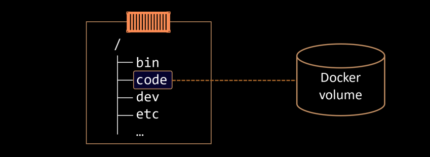
</br>

The figure shows a Docker volume existing outside of the container as a separate object. It is mounted into the
container’s filesystem at /data, and any data written to the /data directory will be stored on the volume and
will exist after the container is deleted.

#### Creating and managing Docker volumes
***Volumes*** have also their own `docker volume` sub-command.

Use the following command to create a new volume called *myvol*.
```bash
$ docker volume create myvol
myvol
```

By default, Docker creates new volumes with the built-in local driver.  You can use the `-d` flag to specify a different driver.

Now that the volume is created, you can see it with the `docker volume ls` command and inspect it with the
`docker volume inspect` command.

```bash
$ docker volume ls
DRIVER                 VOLUME NAME
local                  myvol


$ docker volume inspect myvol
[
	{
		"CreatedAt": "2025-05-02T17:44:34Z",
		"Driver": "local",
		"Labels": {},
		"Mountpoint": "/var/lib/docker/volumes/myvol/_data",
		"Name": "myvol",
		"Options": {},
		"Scope": "local"
	}
]
```

Notice that the Driver and Scope are both local. This means the volume was created with the local driver and
is only available to containers on this Docker host. The Mountpoint property tells us where in the Docker host’s
filesystem the volume exists.

There are two ways to delete a Docker volume:
- `docker volume prune`: will delete all volumes that are not mounted into a container or service replica, so use with caution!.
- `docker volume rm`: lets you specify exactly which volumes you want to delete.

Neither command will delete a volume that is in use by a container or service replica.

As the *myvol* volume is not in use, delete it with the prune command.
```bash
$ docker volume prune

WARNING! This will remove all volumes not used by at least one container.
Are you sure you want to continue? [y/N] y
Deleted Volumes:
myvol

Total reclaimed space: 0B
```

Congratulations, you’ve created, inspected, and deleted a Docker volume.
Let's see now how volumes interact with containers.

#### Demonstrating volumes with containers and services
Let’s see how to use volumes with containers and services.

Ok, let's go with an example.
Use the following command to create a new standalone container that mounts a volume called *bizvol*.

```bash
$ docker container run-dit--name voltainer \
	--mount source=bizvol,target=/vol \
	alpine
```

The command uses the `--mount` flag to mount a volume called “bizvol” into the container at /vol.

The volume is brand new, so it doesn’t have any data. Let’s exec onto the container and write some data to it.
```bash
$ docker container exec -it voltainer sh

/# echo "I promise to write a review of the book on Amazon" > /vol/file1

/# ls-l /vol
total 4-rw-r--r-- 1 root root 50 Jan 12 13:49 file1

/# cat /vol/file1
I promise to write a review of the book on Amazon
```

Type exit to return to the shell of your Docker host, and then delete the container with the following command.
```bash
$ docker container rm voltainer -f
voltainer
```

Even though the container is deleted, the volume still exists:
```bash
$ docker container ls -a
CONTAINER ID          IMAGE          COMMAND          CREATED           STATUS


$ docker volume ls
DRIVER         VOLUME NAME
local          bizvol
```

Because the volume still exists, you can look at its mount point on the host to check if the data is still there.

Run the following commands from the terminal of your Docker host. The first one will show that the file still
exists, the second will show the contents of the file.

```bash
$ ls-l /var/lib/docker/volumes/bizvol/_data/
total 4-rw-r--r-- 1 root root 50 Jan 12 14:25 file1

$ cat /var/lib/docker/volumes/bizvol/_data/file1
I promise to write a review of the book on Amazon
```

Great, the volume and data still exists.
It’s even possible to mount the *bizvol* volume into a new service or container to see that the data persists.

### Volumes and persistent data - The Commands
- **`docker volume create`**:  is the command we use to create new volumes. By default, volumes are created
with the local driver, but you can use the `-d` flag to specify a different driver.
- **`docker volume ls`**:  will list all volumes on the local Docker host.
- **`docker volume inspect`**:  shows detailed volume information.
- **` docker volume prune`**: will delete **all** volumes that are not in use by a container or service replica. **Use with caution!**
- **`docker volume rm`**: deletes specific volumes that are not in use.
- **`docker plugin install`**:  will install new volume plugins from Docker Hub.
- **`docker plugin ls`**:  lists all plugins installed on a Docker host.