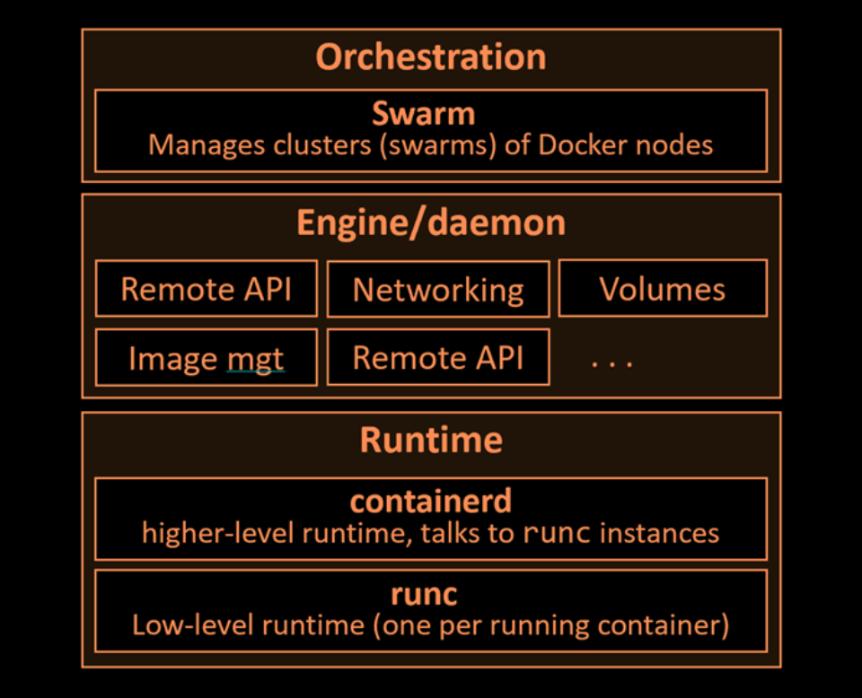

# Docker

---

## Overview
`Docker` is a software that runs on linux and windows. It creates, manages, and can even orchestrate containers.

The name "Docker" is referring to either of the following:
- Docker, Inc The company.
- Docker The technology.

## The Docker Technology
There are three most important things must be aware when we talking about `Docker` as a technology:
- **The runtime**
- **The daemon**
- **The orchestrator**

 

 

The `runtime` operates at the lowest level and is responsible for starting and stopping containers (this includes building all of the OS constructs such as namespaces and cgroups). Docker implements a tiered runtime
architecture with high-level and low-level runtimes that work together.

The low-level runtime is called `runc`. It's job is to interface with the underlying OS and start and stop containers. Every running container on a Docker node has a runc instance managing it.

The high-level runtime is called `containerd`. It's job is to manage the lifecycle of a container, including pulling images, creating network interfaces, and managing lower-level `runc` instances. A typical Docker instalation has a single containerd process (docker-containerd) controlling the runc (docker-runc) instances associated with each running container.

The Docker `daemon` (dockerd) sits above containerd and performs higher-level task such exposing the docker remote API, managing images, managing volumes, managing networks and more...

The Docker `swarms` is a native technology that is used to manage clusters or nodes running docker, it's like Kubernetes. just kubernetes it's common used.

## The Docker Engine
In this part we'll take a quick look under the hood of the Docker Engine. and we'll split it into three main sections:
- The TLDR
- The deep dive
- The commands

### The Docker Engine - The TLDR

The `Docker Engine` is the core software that runs and manages containers.